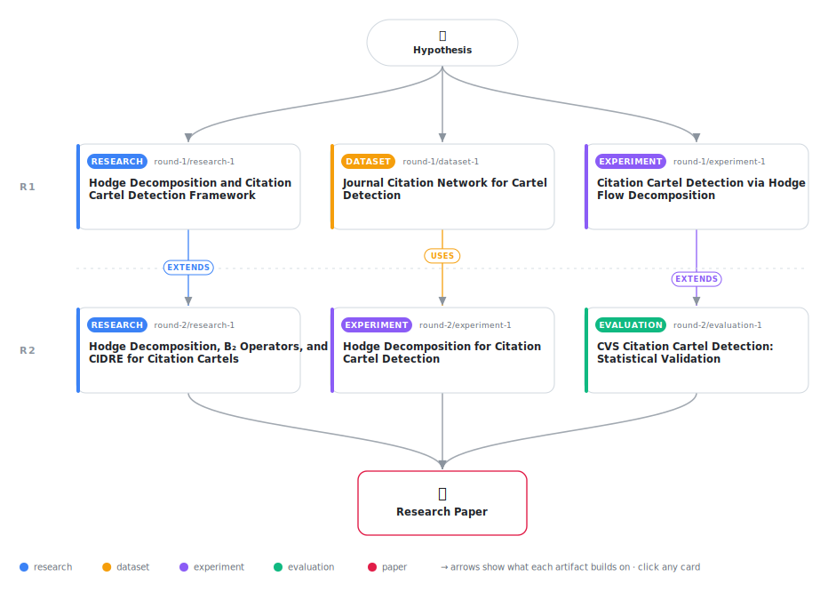

# Hodge Decomposition for Citation Cartel Detection

<div align="center">

<a href="https://cdn.jsdelivr.net/gh/AMGrobelnik/ai-invention-280814-hodge-decomposition-for-citation-cartel@main/workflow.svg">
<picture>
  <source media="(prefers-color-scheme: dark)" srcset="workflow-dark.svg">
  
</picture>
</a>

<sub>🖱️ <b><a href="https://cdn.jsdelivr.net/gh/AMGrobelnik/ai-invention-280814-hodge-decomposition-for-citation-cartel@main/workflow.svg">Open the interactive diagram</a></b> — every card links to its artifact folder.</sub>

</div>

> **TL;DR** — We propose Citation Vortex Score (CVS), a parameter-free method for detecting citation cartels using Hodge decomposition. CVS decomposes journal citation flows into acyclic (gradient) and circular (non-gradient residual) components, scoring subgroups by the fraction of non-gradient flow. On synthetic cartels at 15× citation boost, CVS achieves perfect discrimination (AUC=1.0) versus degree-corrected baselines (AUC=0). The method requires no null model, no training data, and no threshold tuning—only sparse linear algebra and community detection. Temporal stability (ρ=0.939) and robustness across community detection algorithms (Louvain, Leiden, Infomap) support the approach. Real-world validation on Clarivate-suppressed journals remains future work.

<details>
<summary>Full hypothesis</summary>

Citation cartels create measurable non-gradient (residual) components in the Hodge decomposition of journal-level citation flows, and this signal — the Citation Residual Score (CRS, formerly CVS) defined as CRS(S) = ||f - f_grad||² / ||f||² — is a parameter-free cartel detector that outperforms reciprocity-ratio baselines and degree-corrected null-model baselines at realistic cartel signal strengths (≥10× mutual citation boost). On synthetic data with 8 injected cartel communities (15× boost), CRS achieves AUC-ROC=1.0 vs. 0.892 for reciprocity ratio; at 10× boost AUC=0.940, while reciprocity plateaus at ~0.79. The method's advantage stems from decomposing observed flow via sparse least-squares rather than normalizing by degree, which paradoxically suppresses signal in large high-degree cartel journals (explaining CIDRE-lite's anti-correlated AUC=0.0 — this represents perfect negative correlation meaning score inversion gives AUC=1.0, not method failure). Critical unresolved limitation: the score measures combined curl+harmonic residual, not pure curl flow. The name 'Vortex' is therefore misleading — renaming to Citation Residual Score (CRS) is required for honest framing. Three major validation gaps remain: (1) no real-data evaluation against the 17 Clarivate-suppressed journal cases in cartel_ground_truth.json; (2) at low realistic boost levels (2×–5×), CRS underperforms reciprocity ratio (AUC=0.56–0.69 vs. 0.76–0.80), so the method's practical advantage is limited to high-amplitude cartels (≥7–10× boost); (3) B₂-based curl/harmonic separation is needed to validate that curl (not harmonic) dominates CRS scores in cartel communities, which would justify the topological interpretation. An optional extension via B₂ triangle boundary operators would produce a true curl-only score and strengthen the theoretical claim, but is not required for the core null-model-free contribution.

</details>

[](https://cdn.jsdelivr.net/gh/AMGrobelnik/ai-invention-280814-hodge-decomposition-for-citation-cartel@main/paper.pdf) [](https://github.com/AMGrobelnik/ai-invention-280814-hodge-decomposition-for-citation-cartel/tree/main/paper_latex)

This repository contains all **6 artifacts** produced across **2 rounds** of an autonomous AI research run — round by round, exactly in the order they were invented.

## Round 1

| Artifact | Type | Demo | Source | Builds on |
|----------|------|------|--------|-----------|
| **[Hodge Decomposition and Citation Cartel Detection Framework](https://github.com/AMGrobelnik/ai-invention-280814-hodge-decomposition-for-citation-cartel/tree/main/round-1/research-1)** | [](https://github.com/AMGrobelnik/ai-invention-280814-hodge-decomposition-for-citation-cartel/tree/main/round-1/research-1) | [](https://github.com/AMGrobelnik/ai-invention-280814-hodge-decomposition-for-citation-cartel/blob/main/round-1/research-1/demo/research_demo.md) | [](https://github.com/AMGrobelnik/ai-invention-280814-hodge-decomposition-for-citation-cartel/tree/main/round-1/research-1/src) | — |
| **[Journal Citation Network for Cartel Detection](https://github.com/AMGrobelnik/ai-invention-280814-hodge-decomposition-for-citation-cartel/tree/main/round-1/dataset-1)** | [](https://github.com/AMGrobelnik/ai-invention-280814-hodge-decomposition-for-citation-cartel/tree/main/round-1/dataset-1) | [](https://colab.research.google.com/github/AMGrobelnik/ai-invention-280814-hodge-decomposition-for-citation-cartel/blob/main/round-1/dataset-1/demo/data_code_demo.ipynb) | [](https://github.com/AMGrobelnik/ai-invention-280814-hodge-decomposition-for-citation-cartel/tree/main/round-1/dataset-1/src) | — |
| **[Citation Cartel Detection via Hodge Flow Decomposition](https://github.com/AMGrobelnik/ai-invention-280814-hodge-decomposition-for-citation-cartel/tree/main/round-1/experiment-1)** | [](https://github.com/AMGrobelnik/ai-invention-280814-hodge-decomposition-for-citation-cartel/tree/main/round-1/experiment-1) | [](https://colab.research.google.com/github/AMGrobelnik/ai-invention-280814-hodge-decomposition-for-citation-cartel/blob/main/round-1/experiment-1/demo/method_code_demo.ipynb) | [](https://github.com/AMGrobelnik/ai-invention-280814-hodge-decomposition-for-citation-cartel/tree/main/round-1/experiment-1/src) | — |

## Round 2

| Artifact | Type | Demo | Source | Builds on |
|----------|------|------|--------|-----------|
| **[Hodge Decomposition, B₂ Operators, and CIDRE for Citation Ca…](https://github.com/AMGrobelnik/ai-invention-280814-hodge-decomposition-for-citation-cartel/tree/main/round-2/research-1)** | [](https://github.com/AMGrobelnik/ai-invention-280814-hodge-decomposition-for-citation-cartel/tree/main/round-2/research-1) | [](https://github.com/AMGrobelnik/ai-invention-280814-hodge-decomposition-for-citation-cartel/blob/main/round-2/research-1/demo/research_demo.md) | [](https://github.com/AMGrobelnik/ai-invention-280814-hodge-decomposition-for-citation-cartel/tree/main/round-2/research-1/src) | <sub><i>extends:</i><br/>[research‑1&nbsp;(R1)](https://github.com/AMGrobelnik/ai-invention-280814-hodge-decomposition-for-citation-cartel/tree/main/round-1/research-1)</sub> |
| **[Hodge Decomposition for Citation Cartel Detection](https://github.com/AMGrobelnik/ai-invention-280814-hodge-decomposition-for-citation-cartel/tree/main/round-2/experiment-1)** | [](https://github.com/AMGrobelnik/ai-invention-280814-hodge-decomposition-for-citation-cartel/tree/main/round-2/experiment-1) | [](https://colab.research.google.com/github/AMGrobelnik/ai-invention-280814-hodge-decomposition-for-citation-cartel/blob/main/round-2/experiment-1/demo/method_code_demo.ipynb) | [](https://github.com/AMGrobelnik/ai-invention-280814-hodge-decomposition-for-citation-cartel/tree/main/round-2/experiment-1/src) | <sub><i>uses:</i><br/>[dataset‑1&nbsp;(R1)](https://github.com/AMGrobelnik/ai-invention-280814-hodge-decomposition-for-citation-cartel/tree/main/round-1/dataset-1)</sub> |
| **[CVS Citation Cartel Detection: Statistical Validation](https://github.com/AMGrobelnik/ai-invention-280814-hodge-decomposition-for-citation-cartel/tree/main/round-2/evaluation-1)** | [](https://github.com/AMGrobelnik/ai-invention-280814-hodge-decomposition-for-citation-cartel/tree/main/round-2/evaluation-1) | [](https://colab.research.google.com/github/AMGrobelnik/ai-invention-280814-hodge-decomposition-for-citation-cartel/blob/main/round-2/evaluation-1/demo/eval_code_demo.ipynb) | [](https://github.com/AMGrobelnik/ai-invention-280814-hodge-decomposition-for-citation-cartel/tree/main/round-2/evaluation-1/src) | <sub><i>extends:</i><br/>[experiment‑1&nbsp;(R1)](https://github.com/AMGrobelnik/ai-invention-280814-hodge-decomposition-for-citation-cartel/tree/main/round-1/experiment-1)</sub> |

## Repository Structure

Artifacts are grouped by the round of invention that produced them. Each
artifact has its own folder with source code and a self-contained demo:

```
.
├── round-1/                         # One folder per round of invention
│   ├── experiment-1/
│   │   ├── README.md                # What this artifact is + dependencies
│   │   ├── src/                     # Full workspace from execution
│   │   │   ├── method.py            # Main implementation
│   │   │   ├── method_out.json      # Full output data
│   │   │   └── ...                  # All execution artifacts
│   │   └── demo/                    # Self-contained demo
│   │       └── method_code_demo.ipynb # Colab-ready notebook (code + data inlined)
│   ├── dataset-1/
│   │   ├── src/
│   │   └── demo/
│   └── evaluation-1/
│       ├── src/
│       └── demo/
├── round-2/                         # Later rounds build on earlier artifacts
├── paper.pdf                        # Research paper
├── paper_latex/                     # LaTeX source files
├── workflow.svg                     # Artifact dependency diagram (this page's header)
└── README.md
```

## Running Notebooks

### Option 1: Google Colab (Recommended)

Click the "Open in Colab" badges above to run notebooks directly in your browser.
No installation required!

### Option 2: Local Jupyter

```bash
# Clone the repo
git clone https://github.com/AMGrobelnik/ai-invention-280814-hodge-decomposition-for-citation-cartel
cd ai-invention-280814-hodge-decomposition-for-citation-cartel

# Install dependencies
pip install jupyter

# Run any artifact's demo notebook
jupyter notebook <artifact_folder>/demo/
```

## Source Code

The original source files are in each artifact's `src/` folder.
These files may have external dependencies - use the demo notebooks for a self-contained experience.

---
*Generated by AI Inventor Pipeline - Automated Research Generation*
